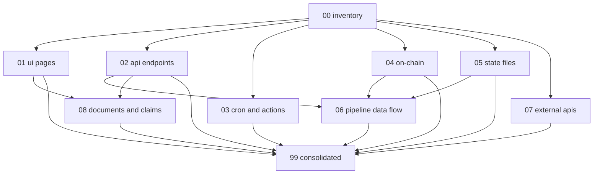

# Design: System Audit Pre-Submission

## Overview

Audit happens in **waves** of independent inspections. Each wave
produces one Markdown report under `.kiro/audits/`. Reports follow a
standard shape so the consolidated report can be assembled mechanically.

The audit is **deliberately read-mostly**. Where a finding is trivial
to fix and the fix is reversible, the auditor MAY apply it inline and
record the commit in the finding. Anything non-trivial gets a
suggested-fix note and an entry in the remediation backlog.

## Architecture

The audit is structured as 9 surface-area inspections plus 6
infrastructure / closure tasks. All inspections write to a shared
`.kiro/audits/` tree. The consolidated report aggregates findings
mechanically — no new analysis, only sorting and statusing.

The audit deliberately produces **artifacts that survive the spec**:
captured raw responses, run-history tables, claim-vs-evidence
crosswalks. Anyone (judge, future contributor, future me) can re-run
the probe scripts and diff the output against what's committed.

## Components and Interfaces

### C1: `audits/` directory layout

```
.kiro/audits/
├── 00-inventory.md            # R1: master surface list
├── 01-ui-pages.md             # R2: every page on the live frontend
├── 02-api-endpoints.md        # R3: every /api/* route
├── 03-cron-and-actions.md     # R4: GH Actions run history
├── 04-on-chain.md             # R5: contracts + recent TXs
├── 05-state-files.md          # R6: data/ + src/data/ JSON files
├── 06-pipeline-data-flow.md   # R7: 2 representative cycles end-to-end
├── 07-external-apis.md        # R8: third-party probes
├── 08-documents-and-claims.md # R9: README / pitch-deck / agent-card
└── 99-consolidated.md         # R10: master findings + remediation
```

Each numbered file maps 1:1 to a requirement and 1:1 to a task.

### C2: Standard report shape

Every audit report uses the same Markdown skeleton:

```markdown
# Audit: <surface category>

**Run at:** <ISO timestamp>
**Auditor:** Kiro (Claude Opus 4.7)
**Method environment:** <where calls were made from>

## Scope

| Surface | Type | Expected freshness | Source of expectation |
|---------|------|--------------------|-----------------------|

## Method per surface

For each surface in scope: how it was probed, what was captured.

## Findings

| ID | Severity | Surface | Expected | Actual | Root cause | Suggested fix |
|----|----------|---------|----------|--------|------------|---------------|

## Not checked

| Surface | Reason |
```

### C3: Severity ladder

- **P0** — User-visible truth violation OR money/security risk in
  production path. Must be fixed before submission.
- **P1** — Reliability problem (cron skips, error swallowed, retry
  missing). Should be fixed pre-submission if time allows.
- **P2** — Code quality / refactor opportunity. Backlog.
- **P3** — Cosmetic / nice-to-have.

The same scale is used in `99-consolidated.md`.

### C4: Probe utilities

To keep audit reproducible, common probes are scripted under
`scripts/audit/`:

```
scripts/audit/
├── fetch-frontend.sh      # curl every / page and / api/ route, save raw
├── gh-actions-runs.sh     # list last N runs from GH API, format as table
├── chain-probe.js         # eth_getCode + tx history for an address
├── check-secrets.sh       # grep captured responses for secret patterns
└── probe-external.sh      # ping every third-party dep
```

These exist so a re-audit one week later doesn't require re-deriving
the methodology — just re-run the script, diff the output.

### C5: Data flow for R7 (pipeline audit)

The pipeline data card is assembled from:

1. `outcomes.json` entry for the chosen `decisionId` → IPFS CID.
2. IPFS pin content (Pinata gateway) → full reasoning JSON.
3. Mantlescan TX of the on-chain attestation → contract event log.
4. `raw_model_outputs/<decisionId>/` if present → exact LLM responses.
5. `cycle-history.json` row → durations + summary.

The data card is one Markdown table per cycle, embedded in
`06-pipeline-data-flow.md`.

### C6: How findings become commits

Each finding in `99-consolidated.md` has a `status` column. Workflow:

- `open` — discovered, not yet acted on.
- `in-progress` — fix being written.
- `fixed` — commit linked. Severity-P0 fixes have a commit hash in the
  table; P1+ fixes can batch-link to a single closing commit.
- `wont-fix-pre-submission` — explicit operator decision; reason in
  notes column.

A fix that requires a contract redeploy is NEVER auto-applied.

## Testing strategy

The audit itself isn't software, but each probe script SHALL be
runnable locally and produce idempotent output (running twice
produces the same shape; values change with reality). Probe scripts
are linted via shellcheck or `node --check` and committed.

## Dependencies between waves



The inventory feeds everything. The consolidated report depends on
all eight surface audits.

## Data Models

### Finding

A single audit finding captured in any surface report and
re-aggregated in `99-consolidated.md`.

| Field | Type | Notes |
|-------|------|-------|
| id | string | `<surface>-<n>` e.g. `ui-3` |
| severity | enum | P0 \| P1 \| P2 \| P3 |
| surface | string | URL or path |
| expected | string | what the README / code claims |
| actual | string | what the probe captured |
| rootCause | string | best-guess hypothesis |
| suggestedFix | string | minimum patch sketch |
| status | enum | open \| in-progress \| fixed \| wont-fix-pre-submission |
| commit | string \| null | hash if fixed |
| notes | string | operator decisions, follow-ups |

### Probe artifact

Raw output of any probe, saved under `.kiro/audits/raw/`. Naming
convention: `<wave-number>-<surface>.<ext>` (e.g.
`01-landing.html`, `02-api-health.json`).

### Audit report

The Markdown report per wave. See §C2 for the skeleton.

## Correctness Properties

### Property 1: No surface unaudited

**Validates: Requirements R1, R10**

Every entry in `00-inventory.md` appears in exactly one of `01-08`.
The consolidated report's `not-checked` section explicitly enumerates
anything that was intentionally excluded. (Formerly CP1.)

### Property 2: No fix without re-probe

**Validates: Requirements R10**

Any finding marked `status=fixed` in `99-consolidated.md` has a
corresponding artifact under `.kiro/audits/raw/post-fix/` showing the
new state. (Formerly CP2.)

### Property 3: No claim without artifact

**Validates: Requirements R9**

Every quantitative claim surfaced in `08-documents-and-claims.md`
either has a verifying artifact link or status `no-artifact` /
`contradicts-artifact`. No claim is left ambiguous. (Formerly CP3.)

### Property 4: Severity discipline

**Validates: Requirements R10**

P0 findings either have `status=fixed` or
`status=wont-fix-pre-submission` with an operator-recorded reason
before T15 closes. No P0 ends in status `open`. (Formerly CP4.)

## Error Handling

- **External dep unreachable from this environment** — the report
  records the failure mode but does not fail the audit. The probe
  output explicitly says "could not reach X from this environment".
- **Live URL returns 5xx** — finding logged at P0; subsequent probes
  on that surface skip with reason.
- **Disagreement between source-of-truth files** — both values are
  recorded with their timestamps; the auditor does NOT pick a winner
  without operator input.
- **Probe script failure mid-run** — the run is restartable;
  partial artifacts in `.kiro/audits/raw/` are preserved with their
  timestamps so a re-run produces a diffable trail.

## Performance

Each surface audit is bounded to 30 minutes of agent time. Pipeline
audit (R7) is bounded to 60 minutes because it walks IPFS, Mantlescan,
and raw LLM outputs.
